# Grodzinski Bakery — Website Review

> **Reviewed:** April 10, 2026
> **URL:** `http://localhost:5173` (Vite dev server)
> **Routes reviewed:** `/`, `/menu`, `/gallery`, `/catering`, `/about`, `/visit`
> **Viewports:** Desktop (1440px) · Mobile (390px)

---

## Table of Contents

1. [Home (`/`)](#1-home-)
2. [Menu (`/menu`)](#2-menu-menu)
3. [Gallery (`/gallery`)](#3-gallery-gallery)
4. [Catering (`/catering`)](#4-catering-catering)
5. [About (`/about`)](#5-about-about)
6. [Visit Us (`/visit`)](#6-visit-us-visit)
7. [Global Technical Analysis](#global-technical-analysis)
8. [Summary & Verdict](#summary--verdict)

---

## 1. Home (`/`)

### Screenshots

| Desktop (1440px) | Mobile (390px) |
|---|---|
| 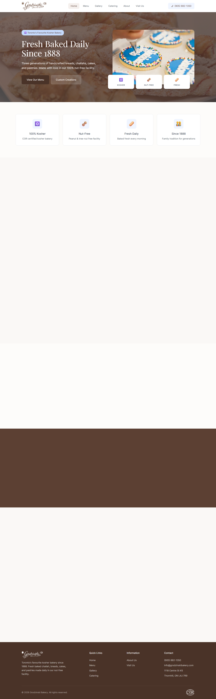 | 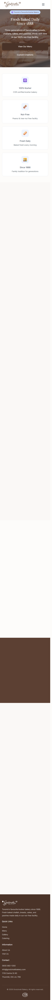 |

**Route/URL:** `http://localhost:5173/`

### Technical Analysis

- **Tech stack:** React 19 + Vite (rolldown-vite 7.1.14), React Router DOM 7, Motion (framer-motion successor), react-icons. CSS is a hybrid of Tailwind 3.x (loaded via `index.css`) and a massive hand-written `App.css` (~4,600 lines) with CSS custom properties. Tailwind is effectively unused — no `@apply` directives, no utility classes in JSX beyond `text-center` and `mt-8`.
- **Component structure:** Hero section with `FadeIn`/`ScaleReveal` animation wrappers, feature cards in a `StaggerContainer` grid, category cards, about snippet, CTA section, and an embedded Google Maps iframe + inline contact form. Data is hardcoded in the component — no external data fetching.
- **Performance concerns:** Full-page screenshot is **extremely tall** (~3,500px+) which suggests the home page is long but large sections appear **blank/empty** — the "Browse Our Selection" category cards and "About" snippet sections are invisible in the screenshot because `ScrollReveal` animations require scrolling to trigger. This means above-the-fold content is just the hero + 4 feature cards, then a vast white void. The Google Maps iframe loads eagerly. Multiple hero images are not lazy-loaded.
- **Code quality:** BEM-style class naming is consistent (`hero__title`, `feature-card__icon`). File organization is clean — pages in `src/pages/`, components in `src/components/`. Data is hardcoded directly in JSX rather than extracted to data files (except `productData.js`). The form uses `alert()` for submission feedback — a UX anti-pattern.

### Design & Visual Analysis

- **Does it look outdated?** The hero section is competent but generic. Brown background with white text and a floating product image is safe but unremarkable. The feature cards with emoji icons below the hero feel very 2020 — rounded cards with icons in circles. The overall layout is a standard "hero → features → categories → about → CTA → contact" template flow that every website builder produces.
- **Emoji usage:** **Heavy and problematic.** Emojis are used as primary icons everywhere: ✡️ for Kosher, 🥜 for Nut-Free, 🥖 for Fresh, 👨‍👩‍👧‍👦 for Since 1888, 💒 for Weddings, 👶 for Baby Showers, 📍 for Address, 📞 for Phone, 🕐 for Hours. This looks amateurish and cheap. Emojis render differently across platforms (Windows vs. Mac vs. Android), creating inconsistent branding. They are used in headings, feature cards, and contact info — all places where proper SVG icons would be more professional.
- **Icon quality:** The navbar uses `react-icons` (AiOutlinePhone, AiOutlineMenu, AiOutlineClose) — consistent Ant Design outline icons. But the rest of the site relies entirely on emoji instead of a proper icon library. This creates a jarring inconsistency between the professional navbar icons and the juvenile emoji everywhere else.
- **Font choices:** Playfair Display (serif, for headings) + Inter (sans-serif, for body). Both are extremely common and safe choices. Inter is literally the default font for half the internet. Playfair Display is the go-to "I want it to look elegant" serif. Together they're fine but completely generic — this is the typographic equivalent of choosing "Times New Roman and Arial." No personality, no brand distinctiveness.
- **Color palette:** Brown (#5C4033) as primary with Light Blue (#c5dafc) as accent on a white/cream background. The brown is warm and appropriate for a bakery. However, the blue accent feels disconnected — it doesn't evoke bakery, warmth, or food. The palette is cohesive within the brown range (9 shades defined), but the blue feels tacked on. Overall: safe, uninspired, but not offensive.
- **Spacing & rhythm:** Generally consistent thanks to the CSS variable system. The container max-width (1200px) provides good readability. However, the home page has massive empty white sections between content blocks where scroll-triggered animations haven't fired, creating an awkward experience on first load.
- **Visual hierarchy:** The hero communicates the core value prop within 3 seconds — "Fresh Baked Daily Since 1888" is clear. CTAs ("View Our Menu" / "Custom Creations") are prominent. Below the fold, hierarchy degrades because content is invisible until scrolled.
- **Animations & motion:** Scroll-triggered `ScrollReveal`, `FadeIn`, `StaggerContainer` animations using Motion library. Animations are subtle (0.5-0.7s duration, gentle ease-out curves) and appropriately restrained for a bakery website. Page transitions use `AnimatePresence` with opacity fades. The animations are the best technical aspect of the site — smooth, not gratuitous.
- **Photography & media:** Uses custom bakery product photography (thumbnails of challahs, cakes, cookies, etc.). Photos appear to be real product shots, which is great. However, they're served as full-size JPGs with no srcset/responsive images, and naming follows a `thumbnail_` prefix pattern suggesting they may already be downsized.
- **Overall design vibe:** This looks like a **developer built it using a CSS framework they wrote themselves**, heavily inspired by modern templates. It's clean and functional but lacks the polish of a professional designer — no custom illustrations, no micro-interactions beyond scroll reveals, no unique visual identity beyond the color palette.
- **Design era:** **2021-2022.** The component-card layout, scroll animations, brown/cream palette, and BEM CSS feel like a well-executed 2021 website. Not cutting-edge 2025/2026.
- **Cringe check:** No glassmorphism or gradient blobs. The emoji-as-icons pattern is the most cringe element. The overall aesthetic avoids AI-generated clichés but also avoids having any memorable personality.

### UX Analysis

- **Responsiveness:** Mobile layout exists and works. The hero stacks vertically, feature cards go to 2-column grid, category cards stack. Breakpoints appear to be handled in the CSS. The mobile hamburger menu slides in from the right with a clean animation.
- **Accessibility:** Alt tags are present on images. The navbar has `aria-label="Toggle menu"`. However, many interactive elements (category cards with `onClick`) are `<div>` elements, not `<button>` or `<a>`, which hurts keyboard navigation. No visible focus states observed. Color contrast on brown backgrounds with white text is likely fine. No skip-to-content link. Form labels are basic.
- **User flow:** Navigation is clear — 6 links in the navbar. The home page flows logically from value prop → features → browse → about → CTA → contact. However, scrolling through blank sections (where animations haven't triggered) is confusing.
- **Loading states:** None. No skeleton screens, no spinners. Content either appears (with animation) or doesn't. The form submit uses `alert()` instead of in-page feedback.
- **Empty states & error states:** Not applicable to the home page, but the inline form has no validation feedback beyond HTML5 defaults.

---

## 2. Menu (`/menu`)

### Screenshots

| Desktop (1440px) | Mobile (390px) |
|---|---|
| 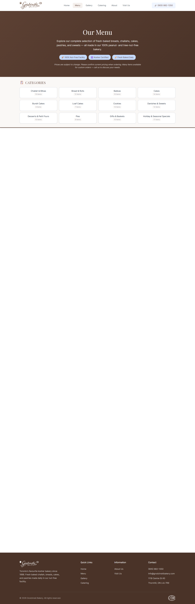 | 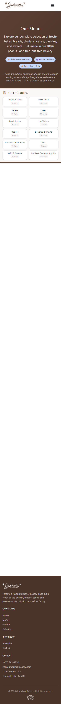 |

**Route/URL:** `http://localhost:5173/menu`

### Technical Analysis

- **Component structure:** Hero with badges, a category quick-nav grid, and collapsible accordion sections for each menu category. Uses `motion/react` for expand/collapse animations. Menu data comes from `menuData.js`. Each menu item has image, name, price, description, and tags.
- **Performance concerns:** All menu categories are rendered in the DOM even when collapsed (they use `AnimatePresence` to mount/unmount). The quick-nav uses `document.getElementById` for scroll targeting — works but isn't the React way. Multiple `setTimeout` calls for sequencing scroll + expand could cause race conditions.
- **Code quality:** The `scrollToCategory` and `toggleCategory` functions have duplicated logic with nested `setTimeout` calls — fragile timing-dependent code. State management uses three useState hooks where a reducer might be cleaner. The component imports `React` unnecessarily (React 19 doesn't need it for JSX).

### Design & Visual Analysis

- **Does it look outdated?** The menu page with collapsible categories is a solid UX pattern. The brown hero banner with white text is consistent. Category buttons in a grid layout are clean. However, the all-collapsed initial state means the page looks empty — just a grid of buttons with item counts. There's no visual preview of the food until you click.
- **Emoji usage:** 🥜, ✡️, 🥖 in the hero badges, 📋 for the categories label. Same problem as the home page.
- **Spacing & rhythm:** The category grid is well-spaced with consistent gaps. When expanded, menu items use a responsive grid. The sticky header calculation (180px offset) is hardcoded, which could break if the header height changes.
- **Visual hierarchy:** "Our Menu" heading is clear. The three badge pills (Nut-Free, Kosher, Fresh) reinforce key brand messages. Category buttons show item counts, which is helpful context.
- **Photography & media:** Menu items include product photos with lazy loading (`loading="lazy"`), which is good. Images have an aspect-ratio wrapper for consistent sizing.

### UX Analysis

- **Responsiveness:** Category buttons reflow from a 4-column grid to 2 columns on mobile. Menu items stack vertically. The layout adapts well.
- **Accessibility:** Category buttons use `<button>` elements with `aria-expanded` attributes — good. The expand/collapse toggle has both text ("Show"/"Hide") and an icon (▼).
- **User flow:** The all-collapsed default means users must click to see anything. Consider showing the first category expanded by default, or showing thumbnail previews in the category buttons.
- **Back to top:** A "back to top" button appears after scrolling 400px — nice touch with animated entrance/exit.

---

## 3. Gallery (`/gallery`)

### Screenshots

| Desktop (1440px) | Mobile (390px) |
|---|---|
| 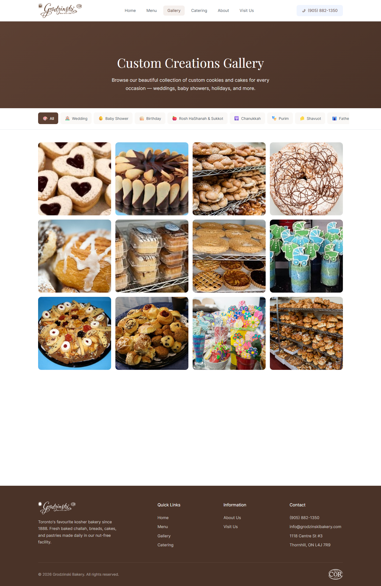 | 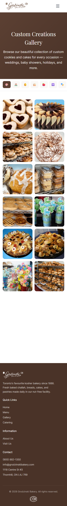 |

**Route/URL:** `http://localhost:5173/gallery`

### Technical Analysis

- **Component structure:** Hero, filter buttons (by occasion), masonry-style photo grid, lightbox modal. Gallery images are hardcoded in a `getGalleryImages` function with a switch statement — not scalable.
- **Performance concerns:** All images load at once for the current filter (up to 12 images). No pagination or infinite scroll. The lightbox opens a full-size version of the same image (no separate high-res source). Image error handler falls back to a cookies thumbnail — lazy but functional.
- **Code quality:** The `getGalleryImages` function generates image paths with template literals and array indices — fragile and hard to maintain. `document.body.style.overflow` is manipulated directly for lightbox scroll locking, which can conflict with the navbar's mobile menu doing the same thing.

### Design & Visual Analysis

- **Does it look outdated?** The gallery grid with filter buttons is a classic pattern that works. The masonry layout shows photos at different sizes, which adds visual interest. Filter buttons with emoji icons (🎂, 💒, 👶, etc.) in pill shapes along the top are clean.
- **Emoji usage:** Every gallery filter category uses an emoji: 📸 All, 💒 Wedding, 👶 Baby Shower, 🎂 Birthday, 🕎 Rosh HaShanah & Sukkot, 🕎 Chanukkah, 🎭 Purim, 🌸 Shavuot, 🇮🇱 Father's Day. The zoom overlay uses 🔍. The empty state uses 📷. This is the most emoji-heavy page.
- **Photography & media:** The gallery images are actual product photographs — custom cookies and cakes for various occasions. The photography quality varies but is generally good. Images are properly sized thumbnails. This is the strongest visual content on the site.
- **Visual hierarchy:** Clear: hero → filters → images. The active filter is visually highlighted. The grid draws the eye naturally.
- **Animations & motion:** Gallery items animate in with staggered scale + opacity transitions. Filter changes trigger `AnimatePresence` animations. The lightbox has scale + fade. All smooth and appropriate.

### UX Analysis

- **Responsiveness:** Grid adapts from 4 columns on desktop to 2 columns on mobile. Filter pills scroll horizontally on mobile (implied by the truncated "Fathe..." text visible in the desktop screenshot).
- **Accessibility:** Images have generic alt text (`Custom creation ${i + 1}`) — not descriptive. The lightbox close button uses `×` character. No keyboard escape handler for the lightbox.
- **User flow:** Browse → filter → click image → lightbox → close. Simple and intuitive. The "Ready to Order?" CTA below the gallery provides a natural next step.
- **Empty states:** The "Coming Soon" empty state with 📷 icon is designed (not a blank page), which is good.

---

## 4. Catering (`/catering`)

### Screenshots

| Desktop (1440px) | Mobile (390px) |
|---|---|
| 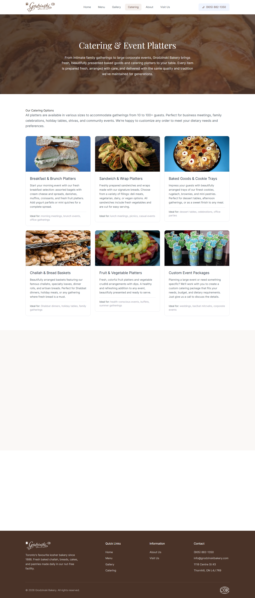 | 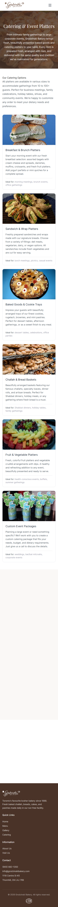 |

**Route/URL:** `http://localhost:5173/catering`

### Technical Analysis

- **Component structure:** Hero with background image overlay, catering options grid (6 cards), "How to Order" steps with numbered list, and CTA. All data is hardcoded in the component — 6 catering option objects with title, description, idealFor, and image.
- **Performance concerns:** Hero uses a background image with an overlay div for the darkening effect. Six catering card images load eagerly. The "How to Order" section renders phone/email as clickable links, which is good.
- **Code quality:** Clean and straightforward. No unnecessary state. The step data uses JSX fragments for the first step's text (phone/email links), which is a nice touch for maintaining linkability.

### Design & Visual Analysis

- **Does it look outdated?** The card grid layout (3 columns on desktop) with image + text is clean and standard. The numbered steps section with large circled numbers is a common pattern that works well. The hero is more visually engaging than other pages because it uses a real food photo as background instead of the generic brown gradient.
- **Emoji usage:** None on this page — it's emoji-free. This is notably more professional-looking than the other pages.
- **Photography & media:** Good real product photos showing actual catering platters (bagels, wraps, cookie trays, challah baskets, fruit platters). The images sell the product effectively.
- **Spacing & rhythm:** Consistent card sizing with uniform gaps. The "How to Order" section has a nice left-content / right-image split layout. Good breathing room between sections.
- **Visual hierarchy:** Clear progression: what we offer → how to order → CTA. Each catering card has a title, description, and "Ideal for:" tag that adds useful context.

### UX Analysis

- **Responsiveness:** Cards stack to single column on mobile with full-width images. The step-by-step section stacks vertically. Works well.
- **Accessibility:** Images have descriptive alt text. Links use proper `<a>` tags for phone and email. Step numbers provide clear visual ordering.
- **User flow:** This is the best-structured page on the site. The flow from browsing options → understanding how to order → taking action is logical and friction-free.

---

## 5. About (`/about`)

### Screenshots

| Desktop (1440px) | Mobile (390px) |
|---|---|
| 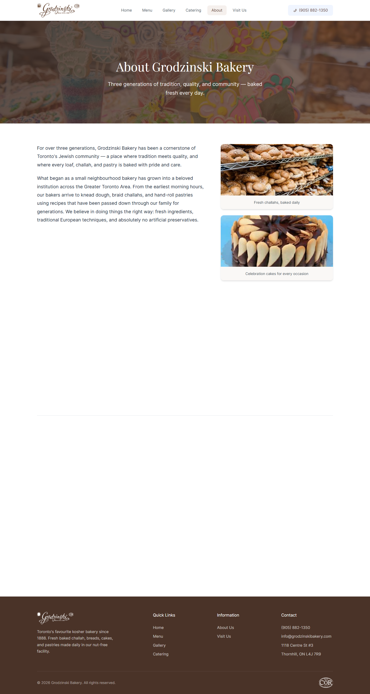 | 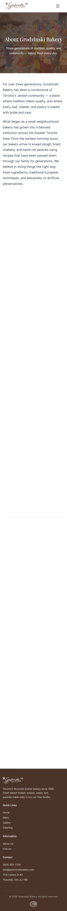 |

**Route/URL:** `http://localhost:5173/about`

### Technical Analysis

- **Component structure:** Hero with background image, main content with left text / right images layout, and a "Why Choose Us" feature grid. All content is inline JSX text — no external content file.
- **Performance concerns:** Three about images load alongside the hero image. The page is relatively lightweight. The "Why Choose Grodzinski?" section renders 6 feature cards.
- **Code quality:** Excessive `ScrollReveal` wrappers — every single paragraph gets its own `ScrollReveal` with incrementing delays (0, 0.1, 0.15, 0.2, 0.25). This means paragraphs fade in one-by-one as you scroll, which feels slow and unnecessary for prose content. The page imports `StaggerContainer` and `StaggerItem` which are only used in the feature grid.

### Design & Visual Analysis

- **Does it look outdated?** The About page is the most generic-looking page. A hero banner, a text-heavy content section with floating images on the right, and a feature grid. This is textbook template layout. The large blocks of paragraph text with no visual breaks (pull quotes, callouts, statistics, timeline elements) make it feel like a blog post.
- **Emoji usage:** 🥜, 👨‍🍳, 🌾, 🥖, 🎂, ❤️ in the "Why Choose Us" feature cards. Same amateur-looking emoji-as-icon pattern.
- **Font choices:** The contrast between Playfair Display headings and Inter body text is most visible here due to the text-heavy layout. It's readable but unremarkable.
- **Photography & media:** Three product photos with captions on the right side. Photos are decent quality but feel like afterthoughts — they don't tell the bakery's story (no photos of the bakers, the shop, the process, the history).
- **Spacing & rhythm:** Good overall, but the paragraphs are dense and long. No visual relief elements (dividers, pull quotes, highlight boxes, timeline graphics).
- **Visual hierarchy:** The hero communicates "About" clearly. Below that, it's a wall of text that requires commitment to read. No scannable elements for skimmers.

### UX Analysis

- **Responsiveness:** Images stack below the text on mobile. Feature cards go from 3-column to single column. Works but the mobile view is very text-heavy.
- **Accessibility:** Good alt text on images. Semantic heading hierarchy (h1, h2, h3). Image captions provide context.
- **User flow:** This is an informational page — users come here to learn about the bakery. The "Why Choose Us" section at the bottom provides quick-scan reasons. No CTA to guide users to the next step.

---

## 6. Visit Us (`/visit`)

### Screenshots

| Desktop (1440px) | Mobile (390px) |
|---|---|
| 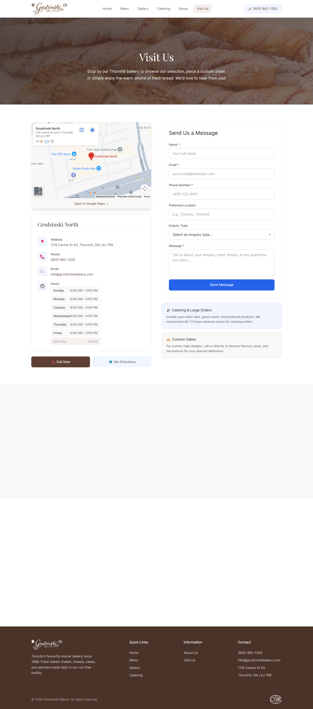 | 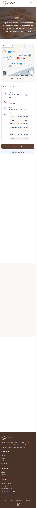 |

**Route/URL:** `http://localhost:5173/visit`

### Technical Analysis

- **Component structure:** Hero, two-column layout (location info + contact form), "Planning Your Visit" tips section, and "Find Our Products Near You" partner cards. Uses the `ContactForm` and `GoogleMap` components.
- **Performance concerns:** The Google Maps embed loads via a separate `GoogleMap` component (which likely renders an iframe). The contact form is a controlled component with proper state management. No form validation library — relies on HTML5 `required` attributes.
- **Code quality:** The `handleContactSubmit` function uses `alert()` and `console.log()` — this is clearly placeholder logic with no actual backend integration. The bakery info is hardcoded as a single object with structured hours data, which is clean.

### Design & Visual Analysis

- **Does it look outdated?** The two-column map + contact form layout is a tried-and-true pattern. The location info card with address, phone, email, and hours is well-organized. The "Planning Your Visit" section with icon + text list items is clean. The "Find Our Products Near You" partner cards feel like padding — they're vague ("select stores and markets") without naming specific locations.
- **Emoji usage:** 📍, 📞, ✉️, 🕐, 📞, 🗺️ for location info. 🎉, 🎂 in info boxes. 🅿️, ⏰, 📞, ✡️, 📅 in the planning list. 🏪, 🛒, 🤝 in partner cards. This is **emoji overload** — almost every piece of information has an emoji prefix.
- **Photography & media:** The "Planning Your Visit" section has a challah photo on the right. The hero uses a bakery photo background. Google Maps embed provides the visual anchor.
- **Spacing & rhythm:** The two-column layout is well-balanced. Hours table is cleanly formatted. Info boxes below the form are nicely contained.
- **Visual hierarchy:** Clear: location info and form are the primary content. Secondary sections (planning tips, partner locations) provide additional value.

### UX Analysis

- **Responsiveness:** On mobile, the map + form stack vertically, map first. The contact form fields are full-width. Hours table remains readable. Call/Directions buttons are full-width CTAs. Well-handled.
- **Accessibility:** Form has proper `<label>` elements. Phone link uses `tel:` protocol. Email uses `mailto:`. The select dropdown for enquiry type provides structured input. However, the form submission feedback uses `alert()`, which is an accessibility concern (screen readers may not handle it well).
- **User flow:** The page answers "where are you?" and "how do I reach you?" efficiently. The contact form is front-and-center. The CTA buttons ("Call Now" / "Get Directions") are prominent.
- **Loading states:** No loading state for the contact form submission. The button text changes to "Sending..." which is minimal but functional.

---

## Global Technical Analysis

### Tech Stack Summary

| Layer | Technology |
|---|---|
| Framework | React 19.2 |
| Build | Vite (rolldown-vite 7.1.14) |
| Routing | React Router DOM 7.9.6 |
| Animation | Motion 12.38 (framer-motion successor) |
| Icons | react-icons 5.5 (Ant Design subset) + emoji |
| CSS | Custom CSS (~4,600 lines) with CSS variables + Tailwind 3.x (unused) |
| Fonts | Playfair Display + Inter (Google Fonts) |

### File Organization

```
src/
├── App.jsx            # Router + layout shell
├── App.css            # 4,604-line monolithic stylesheet
├── index.css          # Tailwind imports + font-face
├── main.jsx           # React entry point
├── menuData.js        # Menu category/item data
├── productData.js     # Product/gallery data
├── components/
│   ├── AnimationWrappers.jsx   # 6 animation components
│   ├── ContactForm.jsx         # Reusable form
│   ├── Footer.jsx              # Site footer
│   ├── GoogleMap.jsx           # Maps embed
│   ├── LocationCard.jsx        # Location display
│   ├── Navbar.jsx              # Navigation
│   └── ProductCard.jsx         # Product display
└── pages/
    ├── About.jsx
    ├── Catering.jsx
    ├── Contact.jsx      # Legacy, not routed
    ├── Gallery.jsx
    ├── Home.jsx
    ├── Locations.jsx    # Legacy, not routed
    ├── Menu.jsx
    └── VisitUs.jsx
```

### Global Performance Concerns

1. **Monolithic CSS:** `App.css` is 4,604 lines in a single file. No code splitting, no CSS modules, no scoped styles. Every page loads every style. This is maintainable for a small site but becomes unwieldy quickly.
2. **Tailwind is dead weight:** Tailwind is installed and imported but barely used. It adds build overhead and CSS output for no benefit. Either commit to using it or remove it.
3. **No image optimization:** No `<picture>` elements, no `srcset`, no WebP/AVIF formats. All images are served as full-resolution JPGs/PNGs regardless of viewport.
4. **No lazy loading for routes:** All page components are imported eagerly in `App.jsx`. React.lazy + Suspense would reduce the initial bundle.
5. **Google Fonts double-loaded:** Fonts are loaded both via `<link>` in `index.html` AND via `@font-face` in `index.css`. This is redundant.
6. **Legacy files:** `Contact.jsx` and `Locations.jsx` exist but aren't routed — dead code.
7. **No error boundaries:** No React error boundary components. A runtime error in any page crashes the entire app.

### Global Code Quality

- **Naming:** BEM-style CSS classes are consistent and readable.
- **State management:** Local `useState` throughout — appropriate for this scale. No global state needed.
- **Data patterns:** Mix of hardcoded JSX data and imported data files. Menu data is external (`menuData.js`), but catering options, about text, and home page content are inline.
- **Animation system:** The `AnimationWrappers.jsx` component is well-designed — reusable, configurable, and consistent. This is the strongest piece of code in the project.
- **Form handling:** `ContactForm.jsx` is a proper controlled component with loading/error states. But the actual submission is a `console.log` + `alert` — no backend integration.

---

## Design & Visual Analysis — Global

### Does it look outdated?

The site is a **solid 7/10 for a local bakery** but falls short of modern 2025/2026 web design standards:

- **What works:** Clean layout, consistent spacing, warm color palette, real product photography, smooth animations.
- **What doesn't:** Emoji-as-icons everywhere, generic template layouts, no unique visual identity, Playfair + Inter is the most common font pairing on the internet, no micro-interactions beyond scroll reveals.

### Emoji Usage — CRITICAL ISSUE

Emojis are used as a **substitute for proper icons** across the entire site:

| Location | Emojis Used |
|---|---|
| Home features | ✡️ 🥜 🥖 👨‍👩‍👧‍👦 |
| Home hero badges | ✡️ 🥜 🥖 |
| Home occasions | 💒 👶 🎂 ✡️ |
| Home contact | 📍 📞 🕐 |
| Menu badges | 🥜 ✡️ 🥖 📋 |
| Gallery filters | 📸 💒 👶 🎂 🕎 🎭 🌸 🇮🇱 |
| Gallery empty state | 📷 |
| Gallery zoom | 🔍 |
| About features | 🥜 👨‍🍳 🌾 🥖 🎂 ❤️ |
| Visit info | 📍 📞 ✉️ 🕐 📞 🗺️ |
| Visit info boxes | 🎉 🎂 |
| Visit planning | 🅿️ ⏰ 📞 ✡️ 📅 |
| Visit partners | 🏪 🛒 🤝 |

**Verdict:** This is **40+ emojis** used as functional icons. They render inconsistently across operating systems, look unprofessional in a business context, and should be replaced with a consistent SVG icon library like Lucide, Phosphor, or Heroicons.

### Icon Quality

- **Navbar:** react-icons (Ant Design outline style) — `AiOutlinePhone`, `AiOutlineMenu`, `AiOutlineClose`. These are proper SVG icons.
- **Everywhere else:** Emoji. The inconsistency between the professional navbar icons and the emoji elsewhere is jarring.
- **Recommendation:** Replace all emoji with Lucide React icons (lightweight, consistent, customizable). Example: `MapPin` instead of 📍, `Phone` instead of 📞, `Clock` instead of 🕐, `Wheat` instead of 🌾.

### Font Choices

- **Playfair Display** (headings): The default "elegant" serif. Used by thousands of bakery/restaurant/wedding sites.
- **Inter** (body): The default "modern" sans-serif. Used by half the internet.
- **Verdict:** Functional but personality-free. Consider: **Fraunces** (a warm, bouncy serif that feels handcrafted — perfect for a bakery) paired with **DM Sans** or **Outfit** (modern but warmer than Inter). Alternatively, **Recoleta** + **General Sans** for a friendlier, more distinctive feel.

### Color Palette

- **Primary:** Brown (#5C4033) — warm, appropriate for a bakery.
- **Accent:** Light Blue (#c5dafc) — feels disconnected. Blue doesn't evoke warmth, baking, or food.
- **Background:** White (#FFFFFF) and Cream (#FAF8F6) — safe.
- **Dark sections:** Brown (#5C4033) backgrounds with white text.
- **Verdict:** The brown is the right choice. The blue accent should be replaced with a warm accent: **burnt orange** (#C4652A), **golden yellow** (#D4A853), or **terracotta** (#C4784A) would complement the brown and evoke bakery warmth.

### Spacing & Rhythm

- Generally consistent using CSS variables (`--container-max: 1200px`, `--container-padding: 1.5rem`).
- Section padding follows a pattern but some sections feel cramped (feature cards) while others have too much space (the void between home page sections where animations haven't triggered).
- Mobile spacing is adequate but could use more generous padding on smaller screens.

### Animations & Motion

- **Quality:** The best technical aspect of the site. `AnimationWrappers.jsx` provides 6 reusable animation primitives (ScrollReveal, FadeIn, StaggerContainer, StaggerItem, PageTransition, ScaleReveal).
- **Subtlety:** Durations of 0.4-0.7s with gentle ease-out curves. Not flashy, not jarring.
- **Issue:** Scroll-triggered animations cause content to be invisible until scrolled to. In headless browser screenshots (and real user first-impressions), large sections appear blank.
- **Page transitions:** Opacity cross-fade via AnimatePresence — smooth but basic.

### Photography & Media

- **Real product photography** throughout — challah, cakes, cookies, catering platters. This is a major strength.
- **No stock photos** detected. All images appear to be actual Grodzinski products.
- **Image quality varies** — some thumbnails are crisp, others show compression artifacts.
- **Missing:** No photos of the bakery itself, the bakers, the process, or the storefront. These "human" photos would add warmth and authenticity.
- **No video content.** A short bakery sizzle reel would be powerful.

### Overall Design Vibe

**"A developer who knows CSS well built this without a designer, using good taste but no creative direction."** It's clean, consistent, and functional — miles ahead of a WordPress template. But it lacks the soul and uniqueness that a professional bakery brand deserves. There's no element that makes you think "only Grodzinski would have this."

### Design Era

**2021-2022.** The scroll-reveal animations, BEM CSS, brown-and-cream palette, Playfair + Inter fonts, and card-grid layouts are all hallmarks of early-2020s web design. Not outdated, but not current either.

### Cringe Check

- No glassmorphism or gradient blobs.
- No AI-generated aesthetic.
- The **emoji-as-icons** pattern is the biggest cringe factor.
- The lack of a unique visual identity makes it feel template-adjacent even though it's custom-built.
- The `alert()` form submission is a developer-facing anti-pattern that users should never see.

---

## UX Analysis — Global

### Responsiveness

- **Overall:** Good. The site is fully responsive with mobile-specific layouts for all pages.
- **Breakpoints:** CSS media queries handle the responsive behavior (visible in the 4,600-line `App.css`).
- **Mobile menu:** Slide-in drawer from the right with overlay backdrop. Animated with Motion. Body scroll is locked when open. Professional.
- **Issues:** The gallery filter pills get truncated on desktop (visible "Fathe..." text), suggesting the horizontal scroll area needs attention.

### Accessibility

| Issue | Severity | Pages |
|---|---|---|
| Emoji used instead of icon + aria-label | Medium | All |
| Category cards are `<div>` with `onClick` instead of `<button>` | High | Home |
| Gallery images have generic alt text | Medium | Gallery |
| No keyboard escape for lightbox | Medium | Gallery |
| Form uses `alert()` for feedback | Medium | Home, Visit |
| No skip-to-content link | Low | All |
| No focus-visible styles observed | Medium | All |
| Redundant `<nav>` inside `<nav>` (navbar) | Low | All |

### User Flow

- **Navigation:** Clear 6-item navbar. Phone number in the top-right is smart for a local business.
- **Home → conversion:** The home page provides multiple paths: View Menu, Custom Creations Gallery, About, Contact.
- **Missing:** No online ordering, no "Order Now" CTA. For a bakery in 2026, online ordering (even a simple phone/WhatsApp link) would be expected.

### Loading States

- **Forms:** "Sending..." button text during submission. Minimal but present.
- **Pages:** No loading states. All content is bundled, so there's no async data fetching.
- **Images:** No blur-up placeholders, no skeleton screens. Images pop in or use the browser's default loading behavior.

### Empty States & Error States

- **Gallery empty state:** Designed with icon + message ("Coming Soon"). Good.
- **Form error state:** `contact-form__alert--error` class exists in the form component. Functional.
- **No 404 page.** Navigating to an undefined route renders nothing (no redirect, no error page).

---

## Verdict

### Per-Page Strengths and Weaknesses

#### Home

- **Top strength:** Clear value proposition above the fold
- **Top weakness:** Sections invisible until scrolled due to animation wrappers
- **Biggest improvement:** Remove scroll-trigger requirement for above-fold content

#### Menu

- **Top strength:** Collapsible accordion with smooth animations
- **Top weakness:** Starts fully collapsed — no visual food content without interaction
- **Biggest improvement:** Default-expand the first category or show thumbnail previews

#### Gallery

- **Top strength:** Beautiful product photography with smooth grid animations
- **Top weakness:** Hardcoded image paths, no scalable content management
- **Biggest improvement:** Add descriptive alt text and keyboard lightbox controls

#### Catering

- **Top strength:** Best-structured page — clear progression from options to ordering steps
- **Top weakness:** No pricing information (even ranges) may frustrate users
- **Biggest improvement:** Add approximate pricing tiers or "starting from" prices

#### About

- **Top strength:** Rich storytelling about the bakery's history
- **Top weakness:** Wall of text with no visual breaks
- **Biggest improvement:** Add a timeline, pull quotes, stats ("130+ years", "200+ products"), or founder photos

#### Visit Us

- **Top strength:** All contact methods in one place with structured hours display
- **Top weakness:** Form has no backend — submits to console.log
- **Biggest improvement:** Connect form to an actual email service (Formspree, SendGrid, etc.)

### Top 3 Strengths (Overall)

1. **Real product photography** — No stock photos. The bakery's actual products are showcased throughout, which builds trust and authenticity.
2. **Smooth, tasteful animations** — The `AnimationWrappers.jsx` system provides consistent, subtle motion design that enhances the experience without overwhelming it.
3. **Solid information architecture** — Six clear pages, logical navigation, consistent layout patterns. A user can find what they need quickly.

### Top 3 Things That Make It Look Cheap/Outdated

1. **Emoji-as-icons everywhere** — 40+ emoji used as functional icons across all pages. This is the single most damaging visual issue. They look like placeholders that were never replaced, render inconsistently across devices, and signal "amateur hour" to anyone who's seen a professionally designed website.
2. **Generic font pairing (Playfair Display + Inter)** — These are the web design equivalent of wearing khakis and a blue shirt. Safe, unremarkable, and used by thousands of other bakery/restaurant sites. The typography has zero brand personality.
3. **No unique visual identity** — No custom illustrations, no branded patterns, no distinctive color accent, no unique layout compositions. The site could be any bakery's website with a logo swap. There's nothing that says "Grodzinski" except the content itself.

### Top 3 Highest-Impact Improvements

1. **Replace all emoji with a proper SVG icon library** (Impact: 🔴 Critical)
   - Install `lucide-react` (lightweight, 1000+ icons, tree-shakeable).
   - Replace every emoji with a semantic SVG icon: `<Star />` for Kosher, `<Leaf />` for Nut-Free, `<Wheat />` for Fresh, `<MapPin />` for Address, `<Phone />` for Phone, `<Clock />` for Hours, etc.
   - Add `aria-label` attributes for accessibility.
   - Estimated effort: 2-3 hours. Instant professionalism boost.

2. **Upgrade the typography** (Impact: 🟠 High)
   - Replace Playfair Display with **Fraunces** (Google Font, variable, warm and characterful serif that feels handcrafted — perfect for a heritage bakery).
   - Replace Inter with **DM Sans** (Google Font, clean but warmer than Inter, with a friendlier personality).
   - Add a clear typographic scale: display (hero headlines), heading (section titles), subheading, body, caption.
   - Estimated effort: 1-2 hours (font swap + CSS variable updates).

3. **Add warmth to the color accent** (Impact: 🟠 High)
   - Replace the disconnected light blue (#c5dafc) accent with a warm tone that complements the brown: **Golden** (#D4A853) or **Burnt Orange** (#C4652A).
   - This single change makes the entire site feel more cohesive and "bakery."
   - Update the `--accent` and `--blue-*` CSS variables.
   - Estimated effort: 30 minutes.

### Bonus Quick Wins

4. **Remove Tailwind** (or commit to it) — Currently dead weight adding build overhead.
5. **Add a 404 page** — Currently undefined routes render nothing.
6. **Connect the contact form to a real backend** — Formspree or Netlify Forms takes 15 minutes.
7. **Add lazy-loading for routes** — `React.lazy(() => import('./pages/Menu'))` with a Suspense fallback.
8. **Remove the double Google Fonts load** — Pick either the `<link>` tag or the `@font-face`, not both.
9. **Delete legacy files** — `Contact.jsx`, `Locations.jsx`, and the `Grodzinski_Bakery_web/` subfolder are dead code.
10. **Add human photos** — Photos of the bakers, the shop interior, the baking process would add massive warmth and authenticity.

---

## Summary

| Metric | Score | Notes |
|---|---|---|
| **Design Quality** | **5.5 / 10** | Clean and functional but generic. Emoji-as-icons and default font pairing drag it down significantly. Lacks personality and brand identity. |
| **Code Quality** | **7 / 10** | Well-organized React codebase with good component structure, consistent BEM naming, and a solid animation system. Loses points for the 4,600-line monolithic CSS, unused Tailwind, double font loading, no error boundaries, no lazy loading, and `alert()` form handling. |
| **Does this look professional enough to charge money for?** | **No** | It looks like a well-built developer portfolio project, not a professional business website. The emoji icons, generic typography, and template-feeling layouts would make a paying client feel they got a "good enough" website, not a great one. With the 3 highest-impact improvements above (icons, fonts, accent color — ~4-5 hours of work), the answer changes to a **qualified yes** for a local bakery. To be truly impressive, it would also need unique visual identity elements (custom illustrations, branded patterns, process photography). |

### Priority Action Items (Ranked by Impact)

| Priority | Action | Effort | Impact |
|---|---|---|---|
| 1 | Replace all emoji with Lucide React SVG icons | 2-3 hrs | Critical |
| 2 | Swap fonts to Fraunces + DM Sans | 1-2 hrs | High |
| 3 | Change blue accent to warm gold/orange | 30 min | High |
| 4 | Connect contact form to real email service | 30 min | High |
| 5 | Add a 404 page | 20 min | Medium |
| 6 | Remove unused Tailwind or commit to using it | 30 min | Medium |
| 7 | Add `React.lazy` route splitting | 30 min | Medium |
| 8 | Fix double Google Fonts loading | 10 min | Low |
| 9 | Delete legacy files (Contact.jsx, Locations.jsx, Grodzinski_Bakery_web/) | 10 min | Low |
| 10 | Add human/process photography | Variable | High (non-code) |
